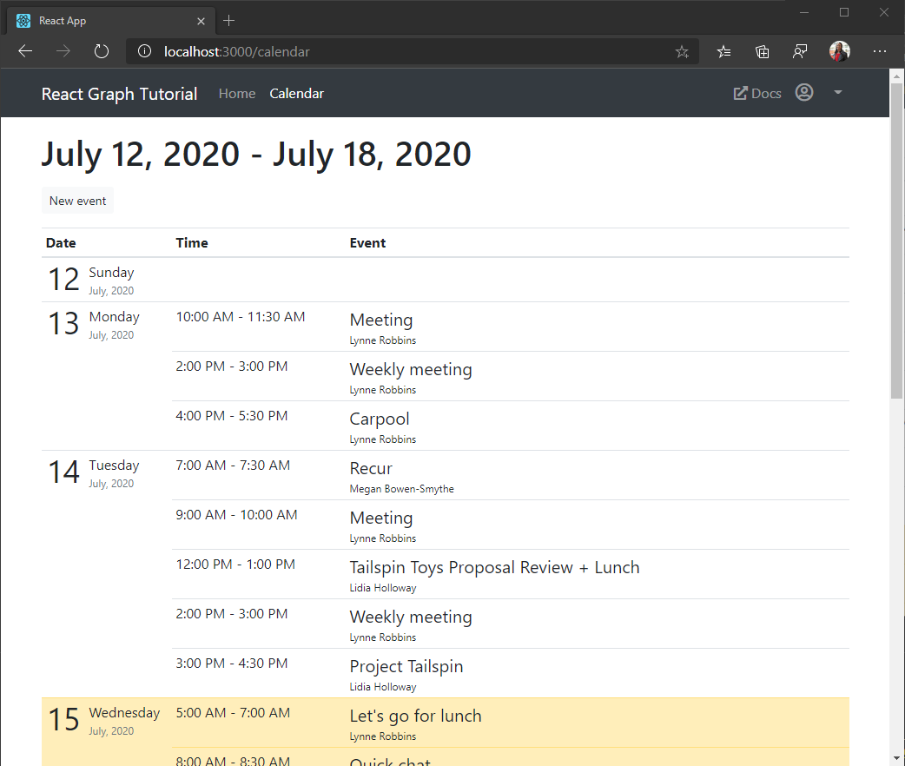

<!-- markdownlint-disable MD002 MD041 -->

En este ejercicio, incorporará Microsoft Graph a la aplicación. Para esta aplicación, usará la biblioteca de [Microsoft-Graph-Client](https://github.com/microsoftgraph/msgraph-sdk-javascript) para realizar llamadas a Microsoft Graph.

## <a name="get-calendar-events-from-outlook"></a>Obtener eventos de calendario de Outlook

1. Abra `./src/GraphService.ts` y agregue la siguiente función.

    :::code language="typescript" source="../demo/graph-tutorial/src/GraphService.ts" id="getUserWeekCalendarSnippet":::

    Tenga en cuenta lo que está haciendo este código.

    - La dirección URL a la que se llamará es `/me/calendarview` .
    - El `header` método agrega el `Prefer: outlook.timezone=""` encabezado a la solicitud, lo que provoca que las horas de la respuesta estén en la zona horaria preferida del usuario.
    - El `query` método agrega los `startDateTime` `endDateTime` parámetros y, que define la ventana de tiempo para la vista de calendario.
    - El `select` método limita los campos devueltos para cada evento a solo aquellos que la vista usará realmente.
    - El `orderby` método ordena los resultados por la fecha y hora en que se crearon, con el elemento más reciente en primer lugar.
    - El `top` método limita los resultados a los primeros 50 eventos.
    - Si la respuesta contiene un `@odata.nextLink` valor, lo que indica que hay más resultados disponibles, `PageIterator` se utiliza un objeto para recorrer en una [página la colección](https://docs.microsoft.com/graph/sdks/paging?tabs=typeScript) y obtener todos los resultados.

1. Cree un componente de reAct para mostrar los resultados de la llamada. Cree un nuevo archivo en el `./src` directorio denominado `Calendar.tsx` y agregue el siguiente código.

    ```typescript
    import React from 'react';
    import { NavLink as RouterNavLink } from 'react-router-dom';
    import { Table } from 'reactstrap';
    import moment, { Moment } from 'moment-timezone';
    import { findOneIana } from "windows-iana";
    import { Event } from 'microsoft-graph';
    import { config } from './Config';
    import { getUserWeekCalendar } from './GraphService';
    import withAuthProvider, { AuthComponentProps } from './AuthProvider';

    interface CalendarState {
      eventsLoaded: boolean;
      events: Event[];
      startOfWeek: Moment | undefined;
    }

    class Calendar extends React.Component<AuthComponentProps, CalendarState> {
      constructor(props: any) {
        super(props);

        this.state = {
          eventsLoaded: false,
          events: [],
          startOfWeek: undefined
        };
      }

      async componentDidUpdate() {
        try {
          // Get the user's access token
          var accessToken = await this.props.getAccessToken(config.scopes);
          // Convert user's Windows time zone ("Pacific Standard Time")
          // to IANA format ("America/Los_Angeles")
          // Moment needs IANA format
          var ianaTimeZone = findOneIana(this.props.user.timeZone);

          // Get midnight on the start of the current week in the user's timezone,
          // but in UTC. For example, for Pacific Standard Time, the time value would be
          // 07:00:00Z
          var startOfWeek = moment.tz(ianaTimeZone!.valueOf()).startOf('week').utc();

          // Get the user's events
          var events = await getUserWeekCalendar(accessToken, this.props.user.timeZone, startOfWeek);

          // Update the array of events in state
          this.setState({
            eventsLoaded: true,
            events: events,
            startOfWeek: startOfWeek
          });
        }
        catch(err) {
          this.props.setError('ERROR', JSON.stringify(err));
        }
      }

      render() {
        return (
          <pre><code>{JSON.stringify(this.state.events, null, 2)}</code></pre>
        );
      }
    }

    export default withAuthProvider(Calendar);
    ```

    Por ahora, esto solo representa la matriz de eventos en JSON en la página.

1. Agregue este nuevo componente a la aplicación. Abra `./src/App.tsx` y agregue la siguiente `import` instrucción a la parte superior del archivo.

    ```typescript
    import Calendar from './Calendar';
    ```

1. Agregue el siguiente componente justo después del existente `<Route>` .

    ```typescript
    <Route exact path="/calendar"
      render={(props) =>
        this.props.isAuthenticated ?
          <Calendar {...props} /> :
          <Redirect to="/" />
      } />
    ```

1. Guarde los cambios y reinicie la aplicación. Inicie sesión y haga clic en el vínculo de **calendario** en la barra de navegación. Si todo funciona, debería ver un volcado JSON de eventos en el calendario del usuario.

## <a name="display-the-results"></a>Mostrar los resultados

Ahora puede actualizar el `Calendar` componente para mostrar los eventos de forma más fácil de uso.

1. Cree un nuevo archivo en el `./src` directorio denominado `Calendar.css` y agregue el siguiente código.

    :::code language="css" source="../demo/graph-tutorial/src/Calendar.css":::

1. Cree un componente reAct para representar eventos en un solo día como filas de tabla. Cree un nuevo archivo en el `./src` directorio denominado `CalendarDayRow.tsx` y agregue el siguiente código.

    :::code language="typescript" source="../demo/graph-tutorial/src/CalendarDayRow.tsx" id="CalendarDayRowSnippet":::

1. Agregue las siguientes `import` instrucciones en la parte superior del **calendario. TSX** .

    ```typescript
    import CalendarDayRow from './CalendarDayRow';
    import './Calendar.css';
    ```

1. Reemplace la `render` función existente en `./src/Calendar.tsx` con la siguiente función.

    :::code language="typescript" source="../demo/graph-tutorial/src/Calendar.tsx" id="renderSnippet":::

    Esto divide los eventos en sus días respectivos y representa una sección de tabla para cada día.

1. Guarde los cambios y reinicie la aplicación. Haga clic en el vínculo del **calendario** y la aplicación ahora debe representar una tabla de eventos.

    
